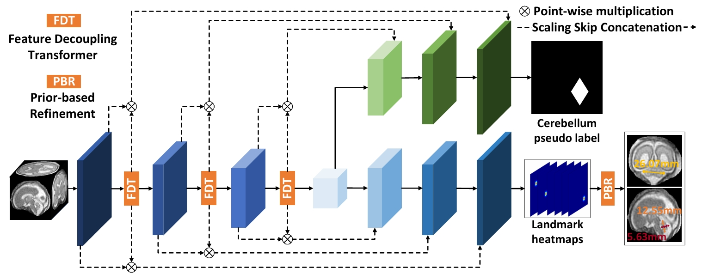

# Fetal Cerebellum Landmark Detection Based on 3D MRI: Method and Benchmark (IEEE JBHI 2025)
Fetal cerebellum landmark detection is crucial for assessing fetal brain development. Although deep learning has become the standard for automatic landmark detection, most previous methods have focused on using 2D ultrasound or thick Magnetic Resonance (MR) images. To improve accuracy, landmarks should be located on thin 3D MR images. However, abnormal development, high noise, and fuzzy boundaries in 3D fetal brain images make traditional methods less effective for cerebellum landmark detection. To address this, we introduce the Anatomical Pseudo-label Guided Attention (APGA) network alongside a 3D MRI-based benchmark for fetal cerebellum landmark detection. During the training process, we use a shared encoder to extract image features and two decoders for landmark regression and anatomical pseudo-label segmentation. We design a Feature Decoupling Transformer (FDT) and embed it into the encoder to better calibrate the features for the two tasks. We only need the encoder, the FDT, and the landmark decoder during the inference phase. Extensive experiments on our proposed benchmark and out-of-domain test set have shown the effectiveness of our method. Our simulations also demonstrated that 3D biometrics are better than 2D biometrics.

## Train and Evaluation
Please follow the **train_3d.py** and **eval_3d.py** for training and evaluation.

## Checkpoints
Pre-trained Weights are available at the following link:
<[Baidu Drive](https://pan.baidu.com/s/1vd1X_FZwPBWcT9uOwdSTqg?pwd=rztx)> with extract code **rztx**.

## Datasets
The training and evaluation dataset will be made available after acceptance.

## Requirements
python >= 3.12
pytorch >= 2.0

## Methods
Overview of the proposed Anatomical Pseudo-label Guided Attention (APGA) network for fetal cerebellum landmark detection. Blue blocks represent the encoder and decoder modules dedicated to landmark regression, while green blocks correspond to the decoder for the pseudo-label segmentation task. During inference, only the blue and the attention-guided orange blocks are utilized.


Comparison of state-of-the-art methods on the MRE (mm). Landmarks at the beginning and end are labeled as "1" and "2," respectively. For 2D prediction, the network first selects the optimal slice and then predicts the landmark on that slice. FLOPs in parentheses denote inference-only values; otherwise, they apply to both training and inference. The \textit{p-value} compares the MREs of our APGA with other methods.


## Citation
```
@article{gong2025fetal,
  author={Gong, Haifan and Liu, Huixian and Wang, Yitao and Liu, Xiaoling and Wan, Xiang and Shi, Qiao and Li, Haofeng},
  journal={IEEE Journal of Biomedical and Health Informatics}, 
  title={Fetal Cerebellum Landmark Detection Based on 3D MRI: Method and Benchmark}, 
  year={2025},
  pages={1-10},
  doi={10.1109/JBHI.2025.3559702}
}
```
